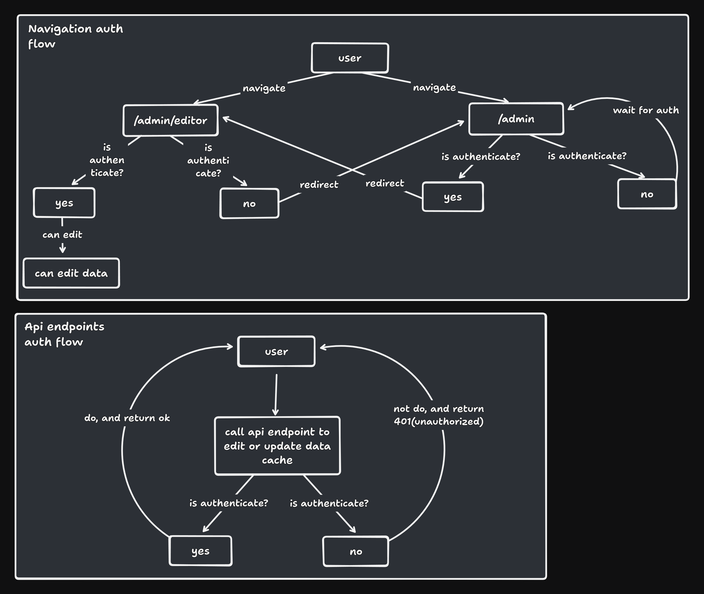

	<h1>Find a friend Api</h1>
	
	

<!-- 

	

 -->

<h4 align="center"> 
	🚧  🚀 Em construção...  🚧
</h4>

## 🚀 Introdução
Esse é um projeto feito com muita dedicação e amor. Aqui você poderá encontrar mais detalhes sobre o projeto e poderá explorar o código-fonte usado para construir meu portfólio.

## 👨‍💻 Tecnologias

- [Javascript/Typescript](https://developer.mozilla.org/pt-BR/docs/Web/JavaScript): Linguagem de programção principal.
- [NodeJS](https://nodejs.org/en): Plataforma para executar JavaScript no backend.
- [NextJS](https://nextjs.org/): Framework React para web .
- [TailwindCSS](https://tailwindcss.com/): CSS framework que prioriza a utilidade.
- [Framer Motion](https://www.framer.com/motion/): Biblioteca de animações para React.
- [React Slick](https://react-slick.neostack.com/): Biblioteca para criação de carrosel no React.
- [Cloudflare R2 - Bucket](https://developers.cloudflare.com/r2/): Armazenamento de objetos rápido e confiável.

<!-- Patterns Highlights -->
## 🔄 Backend e Autenticação

O principal destaque desse projeto é o fluxo de backend criado inteiramente com o NextJS, com o objetivo de facilitar o update de projetos, evitando a relização de commits sempre que houver necessidade de adicionar, editar, ou excluir os projetos em que eu tenho trabalhado e desejo exibir no meu portfolio. Esse fluxo contem, autenticação e validação de rotas e endpoints privados, afim de proteger meus dados. Fique a vontade para explorar o código-fonte para verificar a implementação.

## 📝 Fluxo de Autenticação

	

<!-- Patterns Highlights -->

## 🎯 Principais Recursos

- [x] Pagina de admin para editar e adicionar novos projetos
- [x] Fluxo de autenticação para acessar a pagina de admin e editar projetos
- [x] Internacinalização
- [x] Switch entre tema claro e escuro
- [x] Acesso ai direto ao meu currículo (resumo)
- [x] Carrosel com a biblitoteca react slick

## 🔧 Rodando o Projeto

Para rodar essa aplicação, é necessário ter instalado o [NodeJS](https://nodejs.org/en). Além disso vai precisar ter um conta no Cloudflare R2, configurar uma bucket e um arquivo json e as chaves de acesso ao bucket. No arquivo *.env.example* você poderá encontrar quais as variaveis de ambiente você vai precisar configurar pra rodar o projeto 

- Execute o comando `pnpm install` para baixar as dependências. Você pode usar o gerenciador de pacotes que preferir.
- Execute o comando `pnpm dev` para rodar a aplicação em modo de desenvolvimento.

## 📄 Licença

Este projeto está sob a licença MIT. Acesse o link [LICENSE](https://mit-license.org/) para mais detalhes.

## 🌐 GitHub

O código-fonte da aplicação pode ser encontrado no GitHub: [Project Link](https://github.com/BetaTH?tab=repositories)

## 📧 Contact

Em caso de dúvidas ou sugestões, entre em contato conosco através do email: [thielson12@gmail.com](mailto:thielson12@gmail.com).
